# Claude Code: A Working Engineer's Walkthrough

Six real projects: a game, a Chrome extension, a link in bio page, a landing page, a workflow automation, and a full AI powered mobile app. All built by describing what was wanted in plain English rather than writing code directly.

Claude Code can plan a project, write the code, run it, catch its own bugs, and fix them, often before you see a single file. That's a real shift in how fast an idea can turn into something working. It's also not the whole story. A generated plan is not a design review. A model testing its own code is not a test suite. A clean security scan is not a security audit. None of that makes the tool less useful, it just means the parts of engineering that require judgment, correctness, security, and knowing why something works rather than just that it happened to, are still on you. The six builds below cover both halves: what got built, and what a working engineer would still want to check.

## Contents

1. [What Claude Code actually is](#1-what-claude-code-actually-is)
2. [Where you use it](#2-where-you-use-it)
3. [Subscriptions and usage limits](#3-subscriptions-and-usage-limits)
4. [Build 1: the Cube Tacto game](#4-build-1-a-rubiks-cube-and-tic-tac-toe-game)
5. [Keeping context under control (CLAUDE.md)](#5-keeping-context-under-control-with-claudemd)
6. [Choosing a model](#6-choosing-a-model)
7. [Running builds in parallel](#7-running-builds-in-parallel)
8. [MCPs: connecting Claude to your tools](#8-mcps-connecting-claude-to-your-tools)
9. [Build 5: a Kanban automation](#9-build-5-automating-a-kanban-board-with-granola-and-asana)
10. [Build 6: Morsel, an AI calorie tracking app](#10-build-6-morsel-an-ai-calorie-tracking-app)
11. [API keys and secrets](#11-api-keys-and-secrets)
12. [Getting connected to GitHub](#12-getting-connected-to-github)
13. [Skills and plugins](#13-skills-and-plugins)
14. [Before you ship: a security check](#14-before-you-ship-a-security-check)
15. [Putting it on the internet](#15-putting-it-on-the-internet)
16. [Using it on your phone](#16-using-it-on-your-phone)
17. [Cheat sheet](#17-cheat-sheet)
18. [Every prompt, ready to copy](#18-every-prompt-ready-to-copy)
19. [A software engineer's take](#19-a-software-engineers-take)

***

## 1. What Claude Code actually is

Claude Code is an agentic coding tool. Describe what you want in plain English, and it produces a plan, writes the code, runs it, tests it, finds problems, and fixes them, largely without anyone touching a file directly.

If you've used Lovable, Base44, or built something inside a chat interface before, this will feel familiar. You describe something, it appears. The real difference with Claude Code is where it runs. It works directly on your own machine, creating and editing actual files in a real project folder, rather than inside a hosted sandbox somewhere else. That means real access to your file system, your terminal, and your existing tooling, and generally a lower cost at scale than a fully hosted app builder.

It's worth being precise about what's happening underneath, because it changes how much trust to place in the output. This is still a language model making tool calls, read a file, write a file, run a command, wrapped in a loop that plans, executes, and checks its own work. That's genuinely powerful, but it's only as good as the plan it happened to make and the tests it happened to think of. It doesn't replace actually understanding what the code does, it just moves that understanding to review time instead of writing time.

## 2. Where you use it

There are three ways into Claude Code.

The [desktop app](https://claude.ai/download) is the simplest starting point. Inside it there are three tabs: Chat, which is the regular Claude experience, Co Work, and Code, which is where the actual building happens and what this guide uses throughout.

The terminal is the text based interface Claude Code is actually running through underneath, no matter which front end gets used. Engineers who already live in a terminal tend to prefer working here directly, since it slots naturally into existing shell workflows, aliases, and scripts they already have.

An IDE integration shows every file Claude touches in a live side panel as it works, which matters when the goal is to actually review a diff rather than just trust a summary of what changed. It takes a bit more setup and is worth moving to once the basics feel familiar.

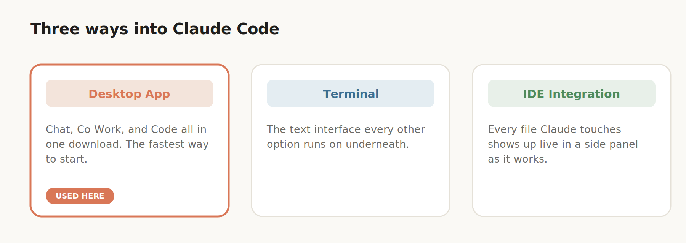
*Chat, Co Work, and Code, the three tabs inside the desktop app. This guide stays in the Code tab throughout.*

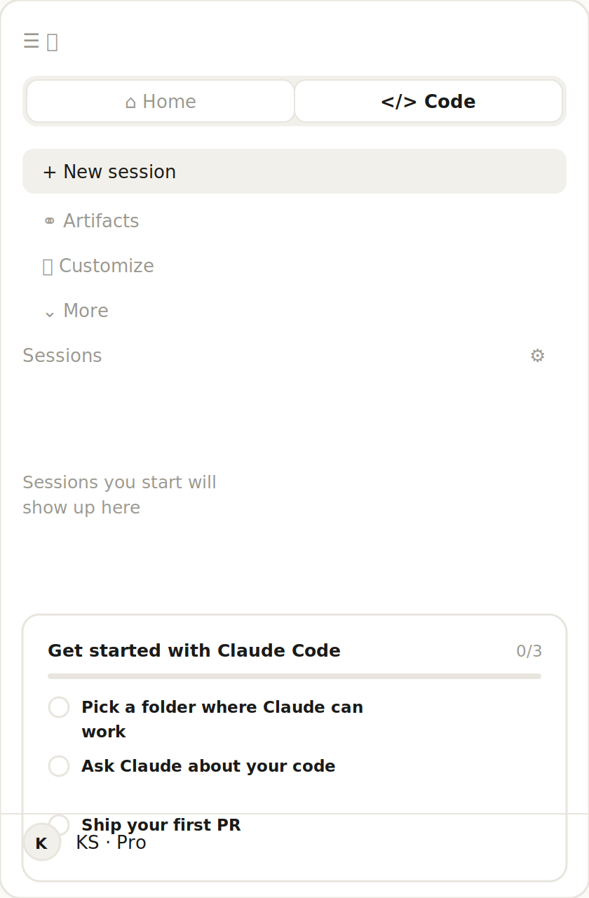
*Home switched to Code, a fresh New session, and the account row at the bottom. This is the real layout.*

## 3. Subscriptions and usage limits

A paid Claude plan is required. Pro, at $20 a month, is a reasonable place to start for learning and for personal tools. Max, at $100 a month, is for people running frequent, heavier builds and gives meaningfully more usage.

Usage resets on a rolling 5 hour window, so hitting a limit mid project isn't a long term blocker. There's also a weekly cap running quietly in the background that's easy to forget about. 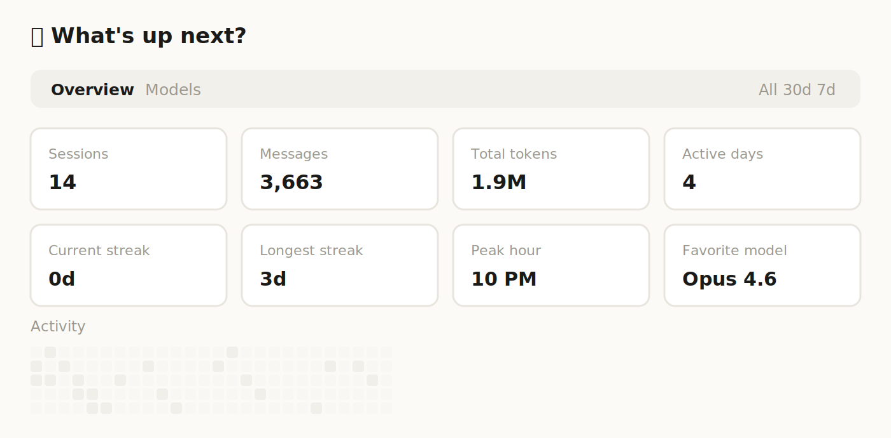
*Sessions, messages, tokens, and streaks, all visible on the Home tab.*

Both are visible under Settings, then Usage, and it's worth treating that number the way any metered API or compute budget gets treated at work. Token spend is a real cost here, not a flat fee once you're inside the app. Burning through a weekly cap on Opus for a project that only ever needed Sonnet is an easy, avoidable mistake.

## 4. Build 1: a Rubik's Cube and Tic Tac Toe game

Every project needs a folder on disk for Claude to work in. It creates files there, edits them, and runs commands against them, the same as any local development environment would.

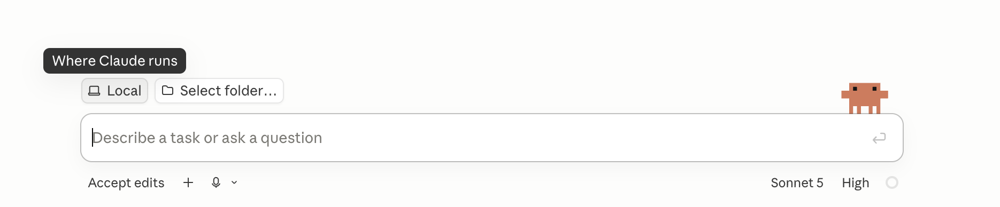
*A recent folder from the dropdown, or Select folder to open the system file picker.*

The first prompt was intentionally minimal, just an idea and a handful of rules:

```
Create a playable browser game that combines a 3x3 Rubik's cube with
tic-tac-toe. On each turn, the active player first places their mark
on an empty sticker on the cube. After placing their mark, that player
must make exactly one standard move of the cube. Victory is checked
after the rotation is completed, not after placing the mark.
```

### Plan Mode first

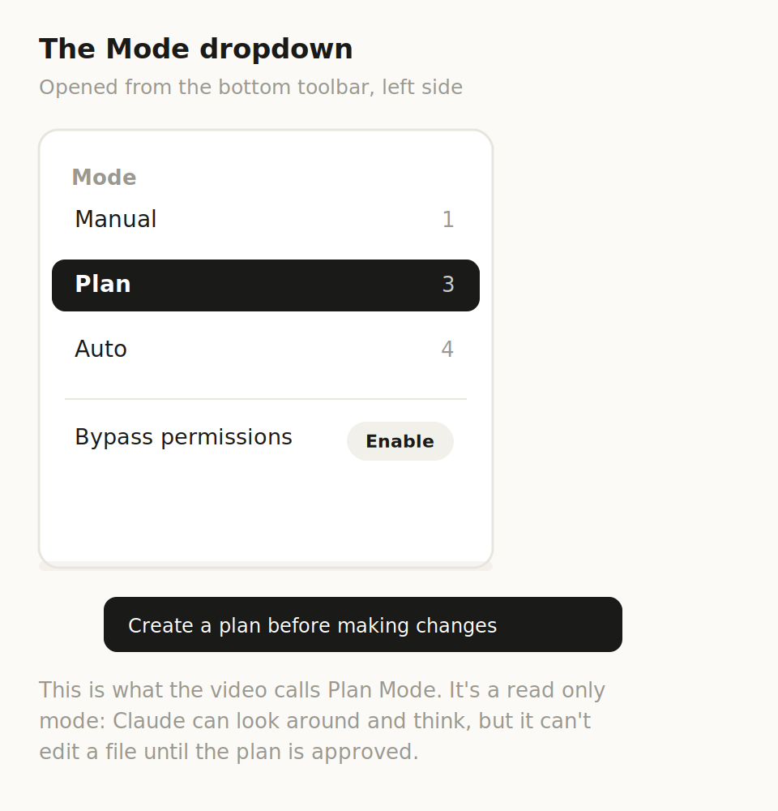
*What the video calls "Plan Mode" is actually one option in this Mode dropdown: Manual, Plan, Auto, or Bypass permissions.*

Before sending any first prompt, it's worth switching on Plan Mode. Instead of jumping straight into code, Claude proposes an implementation plan, asks clarifying questions where it genuinely needs them, and waits for approval before writing anything. It's effectively a lightweight design document, generated automatically, and it's a genuinely useful forcing function, since it surfaces ambiguous requirements before any code exists. It isn't a substitute for real technical design review though. Nobody here is checking whether the proposed architecture scales, whether the state model is sound, or whether there's a cleaner way to represent the cube. That judgment still belongs to whoever is directing the build.

Claude asked which cube moves should be allowed, how a draw should be decided, and how the marks should look. A few answers later, a full plan came back covering the stack, layout, geometry, move logic, and animation approach.

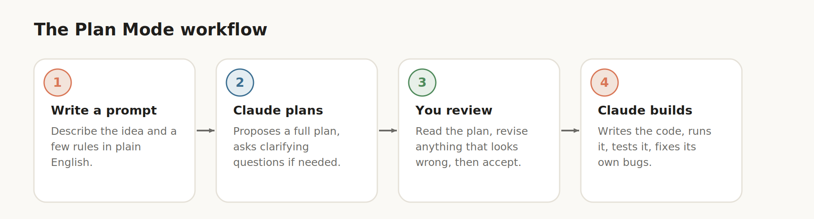
*Prompt, plan, review, build, the loop behind every project in this guide.*

### What happens during the build

Claude works through a visible list of steps: creating files, running commands, updating its own task list. It also opens its own preview and tests the running game itself, clicking through moves, checking results, and going back to fix anything that failed before ever surfacing the result to you.

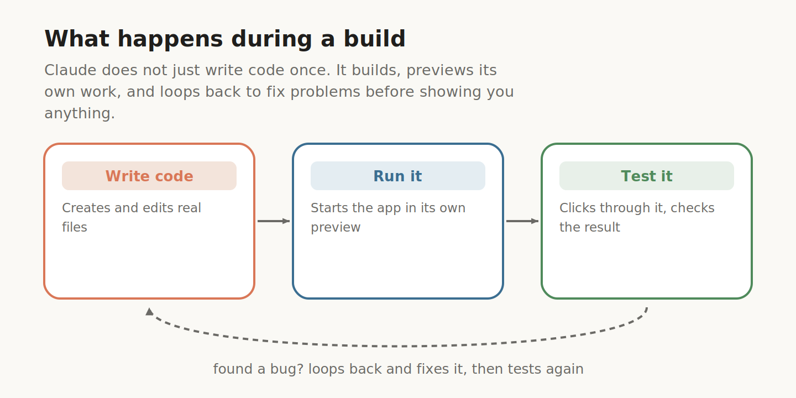
*Claude writes code, runs it, tests it, and loops back to fix problems before showing you anything.*

This self testing loop is one of the more genuinely impressive parts of the whole tool, but it's worth being precise about what it actually is. It's closer to manual exploratory testing performed by the model itself than to a real test suite. There are no unit tests, no regression tests, nothing that runs automatically the next time the code changes. For a game built for fun that's a completely fair tradeoff. For anything that will be maintained over time, or touched by more than one person, someone still needs to add real, repeatable tests on top.

### Iterating

The first version is never the final one. This is where most of the actual engineering judgment gets applied: deciding what's broken, what feels wrong, and what to change next. The single best habit here is changing one thing at a time. Bundle several requests into a single prompt and, if something breaks, there's no clean way to tell which change caused it, which is really the same discipline as making small, reviewable commits instead of one enormous diff.

```
I can't tell which layer is going to rotate before pressing a button.
When hovering over one of the buttons, add a glow to the corresponding
layer, as well as arrows to indicate which direction it will rotate.
```

```
Add an option for an AI opponent. After player one's turn, player two
is an AI that automatically makes a move.
```

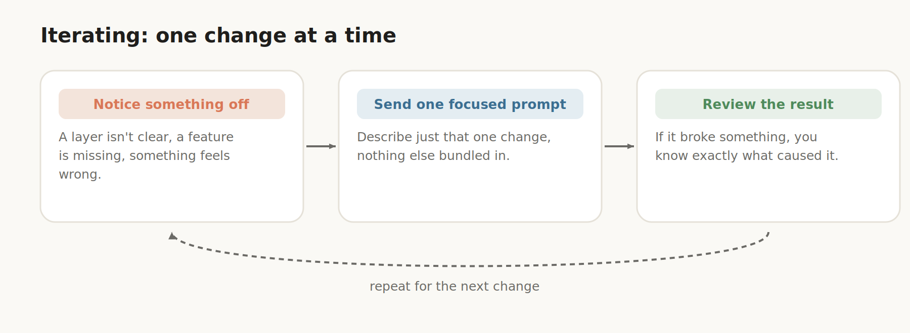
*One change at a time, so a broken result always has an obvious cause.*

From there it was a series of small, focused prompts: letting the cube rotate freely once the game ends, marking the winning line, hiding hints that gave too much away too early, adding difficulty levels, then rebalancing one that was too hard. Each change was a short, plain language follow up, reviewed and accepted before moving on to the next.

## 5. Keeping context under control with CLAUDE.md

Every conversation accumulates history, and Claude uses that history as context. That context window is finite. As it fills up, Claude compacts the conversation, summarizing what came before to make room. Compaction isn't lossless. Detail gets dropped, nuance gets flattened, and quality can drift the longer a single session runs.

The more reliable pattern is starting a new session on purpose rather than letting one grow indefinitely. The tradeoff is that a fresh session knows nothing about the previous conversation. It only knows what's actually saved in the project folder, which is exactly why the next part matters.

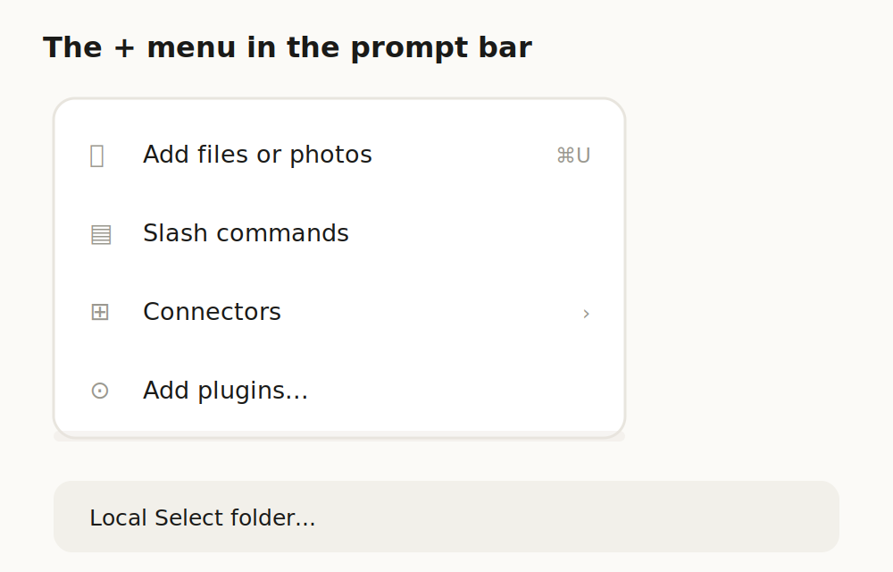
*Slash commands live under the + button, alongside file uploads and connectors.*

Typing `/` opens the full command list, including every built in skill. A few worth knowing beyond the obvious one: `/init` generates a CLAUDE.md file summarizing the project, `/batch` applies large scale changes in parallel, `/compact` manually triggers a summary of conversation history, and `/debug` helps trace down an issue directly.

Running `/init` scans the project and writes out CLAUDE.md automatically, the stack, the architecture, the conventions, anything Claude should treat as a standing rule for that codebase.

This is genuinely close to a practice good teams already follow, keeping living documentation next to the code instead of buried in a wiki nobody opens. It has the same catch documentation always has though, it only stays accurate if someone keeps it updated. CLAUDE.md doesn't automatically stay in sync with the codebase on its own, so it's worth explicitly asking Claude to refresh it after any significant change, and worth a human occasionally reading it just to confirm it still reflects reality.

CLAUDE.md captures the permanent facts about a project, not the state of an in progress task. Before closing a session, this prompt is worth sending:

```
Summarize everything important about this project — the architecture,
decisions we made, current state, and what's left to do — so I can
paste it into a new session.
```

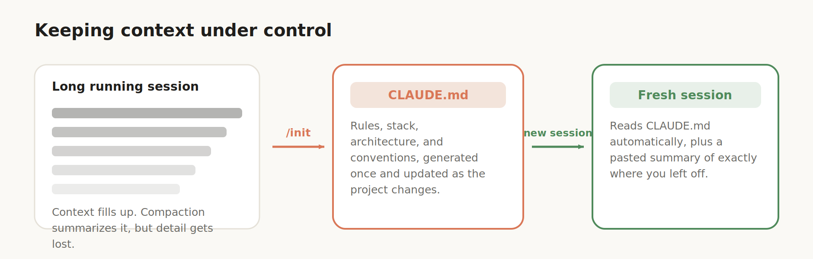
*A long session drifts as it fills up. CLAUDE.md plus a short summary hands a fresh session everything it needs.*

Paste that summary into a fresh session pointed at the same folder, and the new session has both the permanent context from CLAUDE.md and the situational context of exactly where things stood.

## 6. Choosing a model

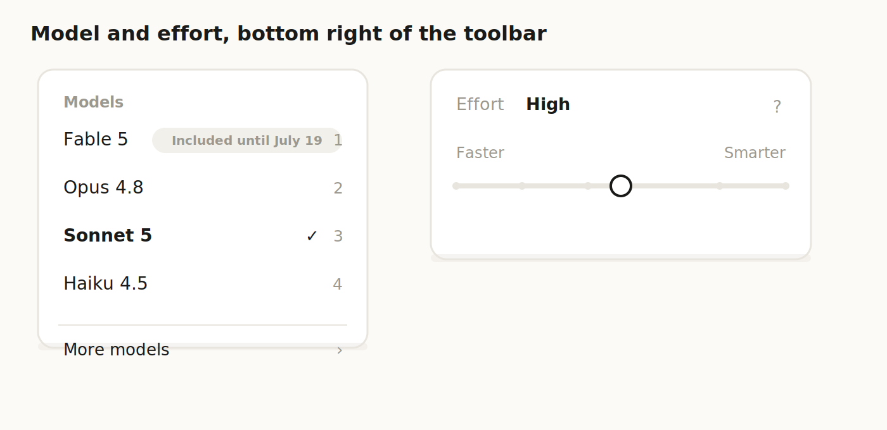
*The current model lineup, and the Faster to Smarter effort slider next to it.*

Claude Code offers three tiers, and picking the right one is a real tradeoff between capability and cost, not just a preference toggle.

Haiku is fast with a very low token cost, but it's too limited for serious building. Sonnet is strong and efficient, and it's the right choice for iterative edits once a project already exists. Opus is the most capable, with the best reasoning on genuinely hard problems, and it's worth reaching for during initial planning and the first build of anything new.

The general pattern that falls out of this: plan and build the first version with Opus, then iterate with Sonnet once the foundation exists. On the Max plan, where limits are less of a concern, running Opus throughout is a reasonable default. There's also a Low, Medium, High, and Max effort setting controlling how many tokens get allocated to a given task, worth matching to actual complexity rather than leaving on autopilot.

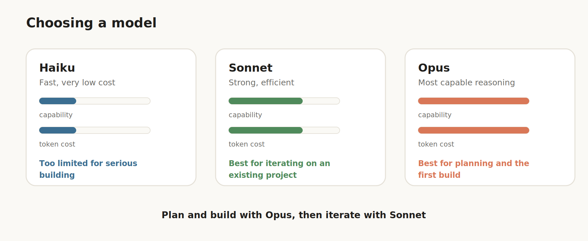
*Capability and token cost both climb together. Match the model to the task.*

None of this guarantees correctness, and that's worth saying plainly. It's the same tradeoff every team already makes choosing between a cheap model for high volume work and a more expensive one for anything that needs real reasoning behind it. Even Opus, handed the hardest problem in the batch, can come back with a confidently wrong answer. The output still needs a second look, particularly anywhere correctness actually matters.

## 7. Running builds in parallel

Initial builds typically take five to fifteen minutes, sometimes longer depending on complexity. Once the basics feel comfortable, multiple sessions can run at the same time, each building a different project. This isn't where a beginner should start though. Get comfortable with a single project first, since running several sessions at once multiplies the number of things that can go sideways simultaneously.

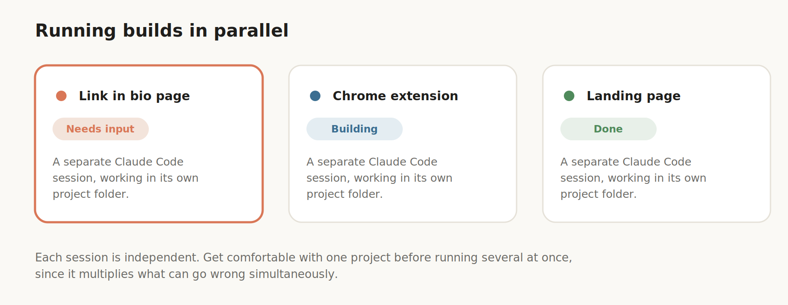
*Independent sessions, each in its own project folder, tracked by status.*

### A link in bio page

The request was for something visually distinctive with a neural network feel. Claude guessed at a couple of URLs incorrectly in the initial plan, an easy fix by revising the plan with the correct links before building. Once built, a missing profile photo was fixed by dropping the image file directly into the project folder and asking Claude to use it, which is generally the more reliable way to hand Claude a real asset than pasting it into chat.

### A Chrome extension

This one solves a small, real annoyance: cleaning up a YouTube transcript that normally comes with timestamps and broken line spacing. The goal was a single button producing clean text.

Installing a Claude built Chrome extension follows the same steps as any unpacked extension: open [chrome://extensions](chrome://extensions), turn on Developer Mode, click Load Unpacked, and select the folder Claude created.

The button initially showed up in the wrong place. Rather than describe that in words, a screenshot of the problem dropped directly into chat was enough context for Claude to fix it. That's a genuinely useful habit anywhere a bug is easier to show than describe, a screenshot in chat is usually faster and more accurate than trying to explain a layout issue in text.

### A product landing page

```
Build a landing page for this product. There is an image in the folder
named futurefuel-can.png. You can use that on the site.
```

From a single product photo, Claude wrote the copy, features, ingredients, testimonials, and produced a complete page with pricing and a call to action.

None of these three builds went through any real QA process, cross browser testing, or accessibility review, and it's worth staying aware of that. Fine for a quick personal project or a prototype. Not something to hand to real users without a human actually checking it against whatever standards matter for that audience.

## 8. MCPs: connecting Claude to your tools

MCP is a protocol that connects Claude Code, or any AI agent, to external tools and services. A reasonable way to picture it is a universal connector, something like USB C for software, that lets different tools plug into an agent in a consistent way. Custom MCPs can be built, but Claude already ships with a large library of prebuilt integrations called connectors.

Connectors live under Customize, then Connectors, or through the Connect Your Apps button, which opens the full browsable list.

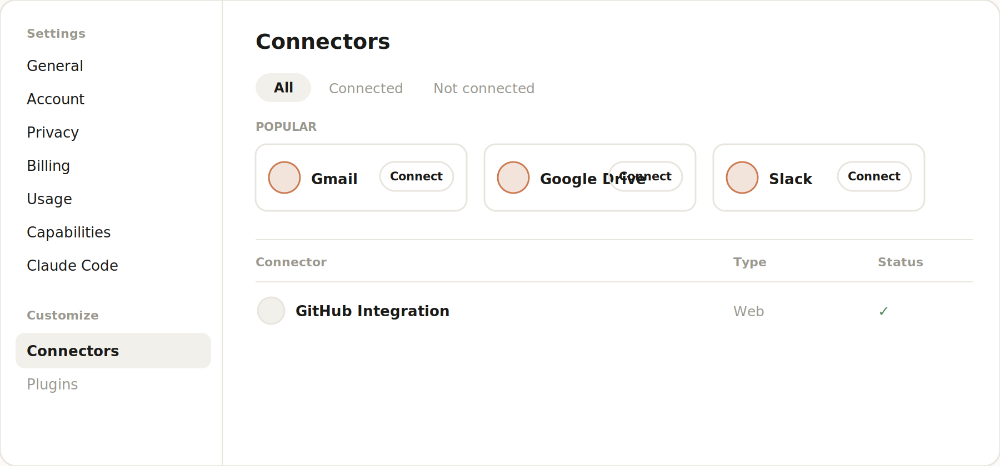
*Settings, then Connectors: popular options up top, everything already connected listed below with its status.*

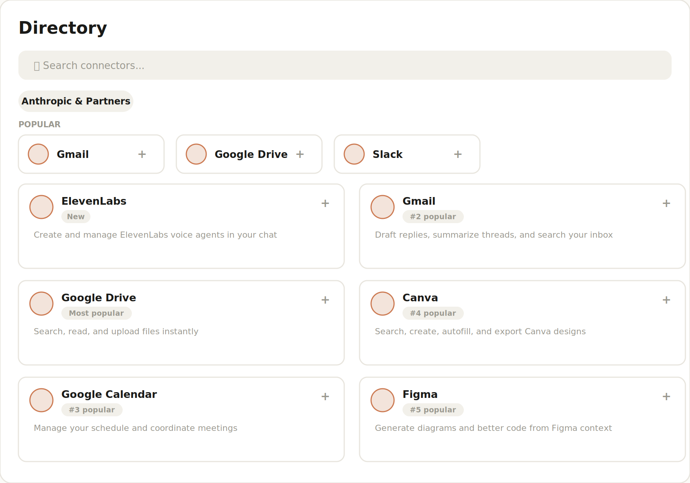
*Browsing the full directory to add a new one, ranked by popularity, each with a short description of what it does.*

A few worth knowing specifically: Granola connects meeting notes, Asana connects team tasks and projects, Context7 pulls current documentation for more than fifty frameworks, which matters because a model's training data can lag behind a framework's actual current API, and Stripe smooths out building anything involving payments.

Once connected, each one can be configured with fine grained permissions, block specific actions, require manual approval, or allow automatically.

This is functionally the same idea as tool calling or function calling, exposed through a shared discovery and permissioning layer. It's convenient, and it's also worth remembering that every connector added is new attack surface and a new place where a mistake, or a prompt injection buried in some untrusted content, could trigger an action nobody actually wanted. The permission model here is coarser than a proper least privilege system in a production environment, so treating allow automatically the way you'd treat a service account with broad scopes, convenient, but something to be deliberate about rather than a default reached for everywhere, is a reasonable instinct to keep.

## 9. Build 5: automating a Kanban board with Granola and Asana

The goal: pull meeting notes from Granola, extract every action item automatically, place them on a Kanban board, pull in the team roster from Asana, allow dragging teammates onto tasks to assign them, then push the result back to Asana with a single click.

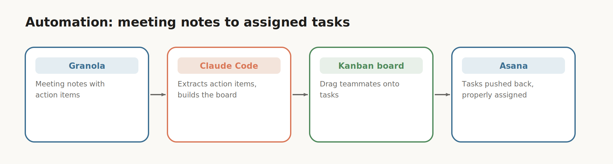
*Granola notes in, action items extracted, tasks assigned, results pushed back to Asana.*

A few errors surfaced along the way and were fixed the same way as everywhere else in this guide, screenshotting the problem and describing the desired fix. The push to Asana button needed adjustment, and a project selector had to be added.

This example deliberately used a less common combination than a typical Gmail or Calendar demo, to make the point that once the tools already used daily are connected, real automation ideas surface quickly.

As shipped though, this is a working prototype, not a production integration, and it's worth naming that plainly. There's no visible retry logic if the push to Asana fails partway through, no idempotency guarantee if a push accidentally gets sent twice, and no handling for what happens if Granola or Asana rate limits the request. Those are exactly the failure modes a real automation running unattended needs to handle, and none of them tend to show up in a quick demo that just happens to work on the first try.

## 10. Build 6: Morsel, an AI calorie tracking app

The most involved build here: an app that uses an AI model through an API to analyze food photos and produce personalized recommendations, designed to feel like a native mobile app.

The reasoning behind building it rather than downloading an existing app is a familiar one for engineers: the closest existing app almost fits but not quite, another subscription isn't worth it, an existing app asks for more data than is comfortable to hand over, or nothing quite like it exists yet.

This is a mobile responsive web app, not a true native app, which is worth being clear about. It's a meaningfully faster thing to build, and it can still be installed to a home screen and feel appropriately app like. A true native app is a longer, different process, worth exploring only once the basics here feel comfortable.

```
Create a mobile responsive web app where I can take a picture of my
food and it will estimate the calories and macros and log them and
track them over time. Use Claude as the model to analyze the images.
Add a feature where you can click and get personalized advice based
on your logs.
```

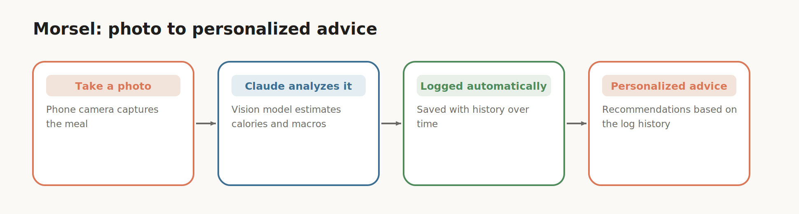
*A photo goes in, Claude's vision model analyzes it, and the result gets logged and turned into advice over time.*

Plan Mode asked several clarifying questions, including which stack to use. The option compatible with Vercel was chosen deliberately, since deployment was already the plan. When a technical option is unclear like this, screenshotting the question and asking Claude directly works well, or keeping a separate chat open for exactly this kind of side question so it doesn't consume the build session's own context. Talking through an idea and letting Claude ask clarifying questions before writing the actual build prompt is also a reasonable way to work.

## 11. API keys and secrets

Testing the AI photo analysis feature requires an API key, a unique string that authorizes access to a service and tracks usage for billing, the same as any other API credential in any other project. A Claude API key, used for calling the model programmatically from inside an app, is separate from a Claude subscription, used for chatting and building inside the app itself. It's funded independently through the Anthropic Console, and each call draws down that balance.

Getting one: open the [Anthropic Console](https://console.anthropic.com/), add funds, go to API Keys, create a new key, name it so usage can be tracked by project, and copy it immediately, since it won't be shown again.

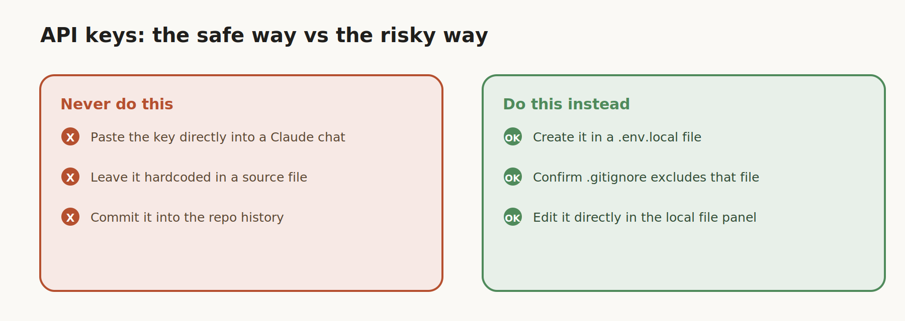
*The right habit and the wrong habit, side by side.*

Here's the part worth taking seriously: never paste an API key directly into a Claude chat. Chat messages travel over the network, and anyone who obtains the key can spend whatever balance is loaded onto it. The correct habit is adding keys to a local file directly, never through the chat interface itself.

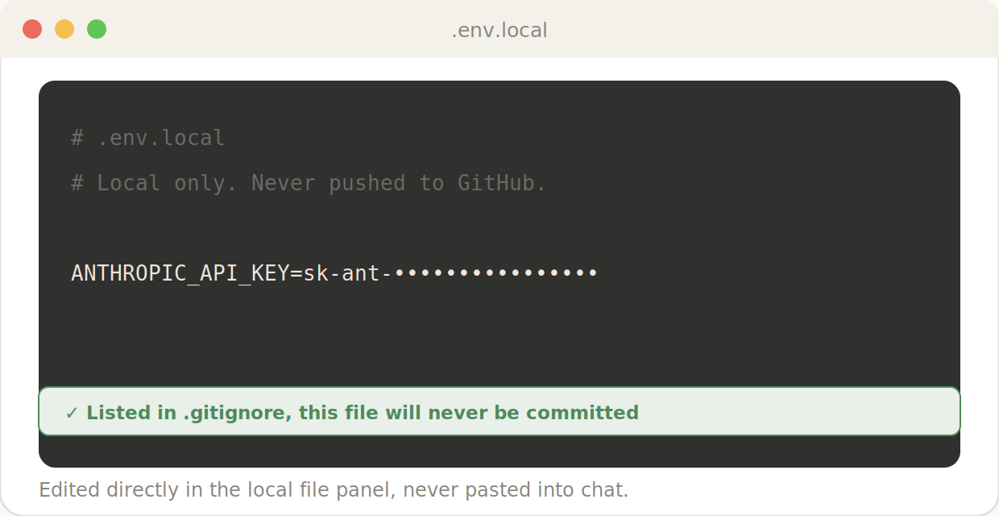
*The key added to a local only file, confirmed excluded from version control.*

The right sequence: ask Claude to create a `.env.local` file, where `.env` denotes environment variables and `.local` means it exists only on this machine. Confirm it's listed in `.gitignore`, which guarantees it never gets pushed to GitHub. Open the file directly in the side panel, at which point the file system is being edited directly rather than through chat. Replace the placeholder with the real key and save it. Then tell Claude the key is in place and ask it to test.

Testing surfaced two quick issues, an API not detected error, and an image too large error that Claude fixed by adding automatic resizing. After that, image analysis worked as expected, along with logging, log history, and personalized advice.

This is basic secrets hygiene, and it's the right minimum bar for a personal project. It isn't a real secrets management setup though. There's no key rotation, no scoping to least privilege, no audit log of when the key gets used, and nothing preventing it from ending up in a screenshot, a backup, or a support ticket by accident. Anything beyond a single person's local machine really wants a proper secrets manager and a rotation policy, not a dotfile sitting on someone's laptop.

## 12. Getting connected to GitHub

[GitHub](https://github.com) hosts the code in the cloud, which means access from any device, easy sharing, deployment, and real version control, a saved history that can be rolled back if something breaks.

Git needs to be installed locally first.

```
Check if I have Git installed. If not, install it for me.
```

It's usually already present on newer Macs. Windows involves slightly different steps, and Claude adjusts its instructions automatically for whichever operating system it detects.

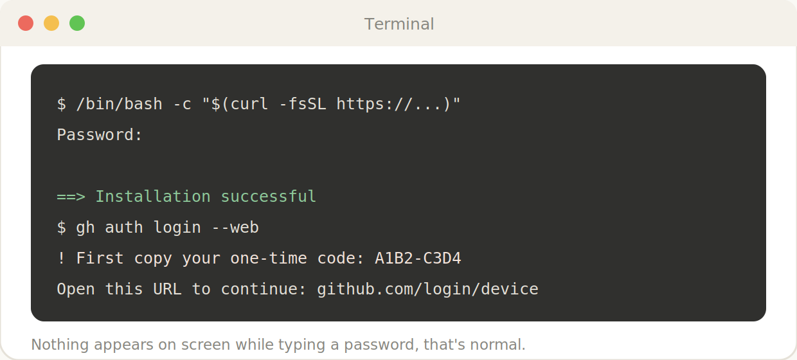
*Homebrew installing, then the GitHub CLI device login, from the same terminal panel.*

Asking Claude to connect to GitHub and walk through the manual steps produces roughly four stages. First, installing Homebrew, where Claude provides a command to paste into the terminal, either opened separately or directly inside Claude Code's own panel. A system password prompt follows, and nothing will visibly appear while typing it, that's standard password masking, not a malfunction. Second, installing the GitHub CLI, which Claude can run itself once approved. Third, authenticating the GitHub account by running one more terminal command, with Claude specifying exactly what to answer at each step, the GitHub instance, the protocol, browser based login, the one time code, and the emailed confirmation code. Fourth, confirming the connection, at which point Claude verifies it can now push code, create and clone repositories, and open pull requests on your behalf.

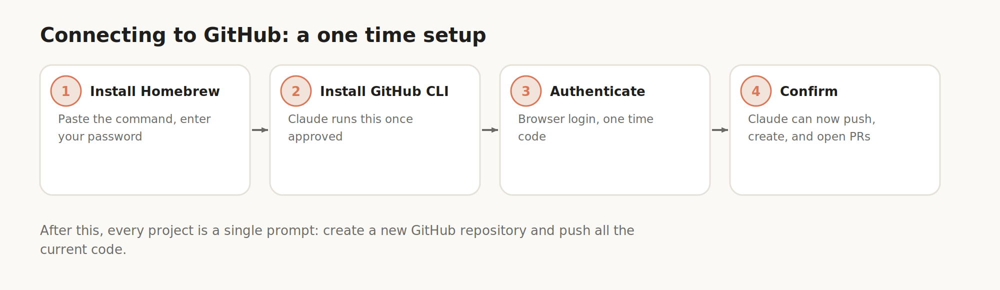
*Homebrew, the GitHub CLI, authentication, and confirmation, four steps done once.*

This setup only needs to happen once. Every project after this is a single prompt:

```
Create a new GitHub repository for this project and push all the
current code.
```

Pushing code this easily is genuinely convenient, and it's also genuinely risky if it becomes a habit without a second thought behind it. There's no pull request review here, no CI pipeline running tests before merge, nothing stopping a broken or half finished change from landing directly on the default branch. For solo, personal projects that's an acceptable risk to take on. For anything touched by more than one person, or anything that actually matters, the usual practices still apply, branches, review, and tests that run before code merges rather than after.

## 13. Skills and plugins

Skills are reusable, packaged workflows for repeatable tasks. Some ship built in, some come from the community, and custom ones can be created by running a multi step process once with Claude and asking it to package that process into a skill for future reuse. Plugins follow the same idea at a broader scope, covering an entire role or workflow rather than a single task. Both have community libraries browsable on GitHub beyond whatever ships by default.

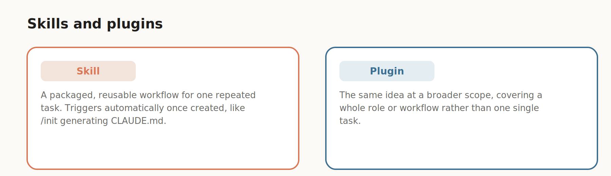
*A skill covers one repeated task. A plugin covers a whole role.*

## 14. Before you ship: a security check

Before making anything public, running the built in security review is worth the small amount of time it takes.

```
Run a security check.
```

Claude scans the codebase for vulnerabilities and returns a full report.

The more sensitive a project is, the more this matters. A simple game with no data collection is low risk. Something like Morsel, which holds an API key and handles personal data, deserves a much closer look, and keeping it private is a reasonable choice until it's actually been hardened.

It's also worth asking one more question before going live:

```
Is there anything else I should be aware of before making this live
for other people to access?
```

This tends to surface non security issues, browser compatibility problems, untested mobile touch behavior, or missing features like a restart option.

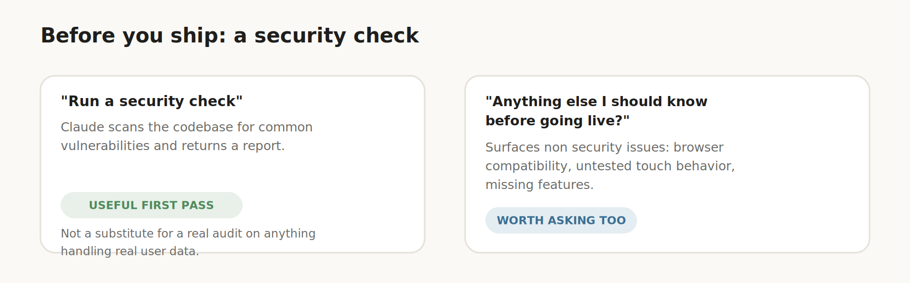
*Two prompts worth running before anything goes public.*

An automated scan like this is a useful first pass, not a real security audit, and it's worth holding that distinction clearly. It catches common, well known patterns. It won't catch a subtle authorization bug specific to this application's own logic, and a clean report means no obvious problems were found by this particular pass, not that none exist. Anything handling real user data, payments, or authentication deserves a genuine review by someone who actually understands the threat model, not just a green checkmark from an automated tool.

## 15. Putting it on the internet

Deployment here uses [Vercel](https://vercel.com), a common platform that's free at personal project scale.

Getting a simple project live: create a Vercel account, optionally signing in with GitHub directly, click Continue with GitHub on the Import Git Repository screen, install to connect Vercel to the GitHub account, select the repositories to connect, then click Import on the project and Deploy.

That's enough to have the project live with a shareable URL. Every subsequent push to GitHub through Claude Code gets automatically detected and redeployed by Vercel, with no additional manual step.

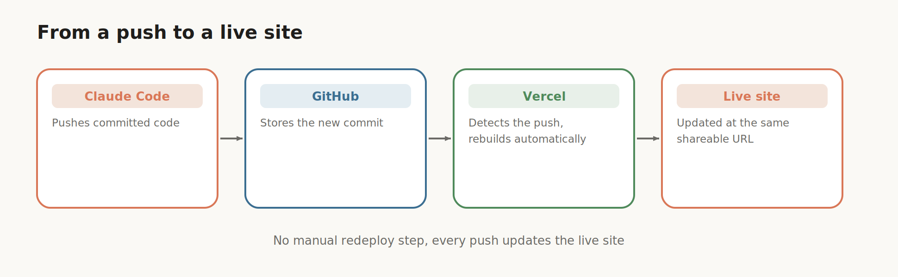
*Every push to GitHub is detected and redeployed automatically, no manual step in between.*

For something like Morsel, the process follows the same shape but hits real friction along the way. The fix loop stays the same throughout, copy the error or screenshot it, hand it to Claude, work through the fix together. Two issues came up that are common enough to expect elsewhere too. Missing environment variables, since `.env.local` is intentionally never pushed to GitHub, the API key and any other secrets have to be added manually inside Vercel's project settings. And storage, since an app that persists data, like food logs and photos, needs somewhere to put it. Vercel's Storage tab supports setting up a database, [Neon](https://neon.tech) in this case, for structured data, and Blob storage for files. Once both are connected alongside the API key as an environment variable, the full pipeline works end to end.

None of this replaces an actual staging environment, monitoring, alerting, or a real rollback strategy beyond reverting a git commit, and that's worth being honest about. It's a fine tradeoff for a personal tool with a handful of users. It isn't a production deployment posture, and treating it like one for anything with real usage or real data behind it is usually where problems start.

## 16. Using it on your phone

Since Morsel is a mobile responsive web app rather than a native one, installing it looks like this: open the deployed site in a phone's browser, tap Share, then Add to Home Screen.

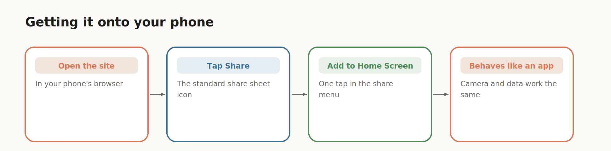
*Open the site, tap Share, Add to Home Screen, and it behaves like any other app.*

From there it sits on the home screen like a native app, existing data is already available since it lives in the cloud database rather than locally, and the phone's camera can be used directly to log new entries, with the same AI analysis running as it did on desktop.

A true native app is a longer, meaningfully different process, worth pursuing once everything covered here feels comfortable, and generally more than most personal projects actually need.

## 17. Cheat sheet

**Claude Code**: an agentic tool that plans, builds, tests, and debugs software from plain language prompts, running locally on your machine.

**Plan Mode**: produces a full implementation plan, with clarifying questions, before any code is written.

**CLAUDE.md**: a persistent file holding a project's rules, stack, and architecture, read automatically at the start of every session.

**`/init`**: the command that generates CLAUDE.md.

**`/batch`, `/compact`, `/debug`**: other built in commands, for parallel changes, manual history summarizing, and troubleshooting.

**Context window and compaction**: the finite memory of a session. Compaction summarizes history once it fills up, at the cost of some detail.

**Haiku, Sonnet, Opus**: fast and light, strong and efficient, and most capable respectively. Match the model to the task.

**MCP**: a protocol connecting Claude Code to external tools and services.

**Connector**: a prebuilt MCP integration, such as Calendar, Notion, Asana, Granola, Context7, or Stripe.

**API key**: a unique authorization string tied to a billing balance.

**`.env.local`**: a local only file for secrets, excluded from version control.

**`.gitignore`**: lists what should never be committed to version control.

**Git and GitHub**: local version control software, and the cloud platform that hosts the resulting repository.

**Skill**: a packaged, reusable workflow that triggers automatically for a repeated task.

**Plugin**: a broader packaged workflow, covering a full role rather than a single task.

**Security review**: a built in scan for common vulnerabilities before a project goes public.

**Vercel**: a deployment platform that redeploys automatically on every push to GitHub.

**Web app vs native app**: a responsive web app installs to a home screen and feels app like, but is far faster to build than a true native app.

## 18. Every prompt, ready to copy

**The game, to start:**
```
Create a playable browser game that combines a 3x3 Rubik's cube with
tic-tac-toe. On each turn, the active player first places their mark
on an empty sticker on the cube. After placing their mark, that player
must make exactly one standard move of the cube. Victory is checked
after the rotation is completed, not after placing the mark.
```

**Iteration examples:**
```
When hovering over one of the buttons, add a glow to the corresponding
layer, as well as arrows to indicate which direction it will rotate.
```
```
Add an option for an AI opponent. After player one's turn, player two
is an AI that automatically makes a move.
```

**Handing off to a new session:**
```
Summarize everything important about this project — the architecture,
decisions we made, current state, and what's left to do — so I can
paste it into a new session.
```

**The landing page:**
```
Build a landing page for this product. There is an image in the folder
named futurefuel-can.png. You can use that on the site.
```

**Morsel, to start:**
```
Create a mobile responsive web app where I can take a picture of my
food and it will estimate the calories and macros and log them and
track them over time. Use Claude as the model to analyze the images.
Add a feature where you can click and get personalized advice based
on your logs.
```

**Git setup:**
```
Check if I have Git installed. If not, install it for me.
```

**Pushing any project to GitHub:**
```
Create a new GitHub repository for this project and push all the
current code.
```

**Before going public:**
```
Run a security check.
```
```
Is there anything else I should be aware of before making this live
for other people to access?
```

## 19. A software engineer's take

Across all six builds, one loop repeats: prompt, Plan Mode, review, build, test, iterate one change at a time, deploy. It genuinely speeds up the parts of engineering that are mostly mechanical, scaffolding a new project, wiring up an API, getting a first working version of something well understood, and iterating on it quickly based on plain language feedback instead of hand editing files.

It doesn't remove the need for engineering judgment, and it was never going to. Nothing here writes real tests on its own. Nothing here reviews a pull request the way a colleague would. Nothing here understands the actual security posture of a system the way a proper threat model does. Nothing here decides whether an architecture holds up at ten times the current load, or whether a shortcut taken today turns painful to unwind in six months. Context can drift, plans can miss edge cases nobody thought to mention, and a security scan that comes back clean is a first pass, not a certificate.

The honest way to put it: Claude Code is a genuinely capable collaborator that removes a lot of the friction between an idea and a working first version. The judgment about correctness, security, maintainability, and whether something is actually ready for other people to depend on still belongs to whoever is directing it. Reading the diff still matters. Understanding why the code works, not just that it happened to work this time, still matters. That part hasn't changed at all.
